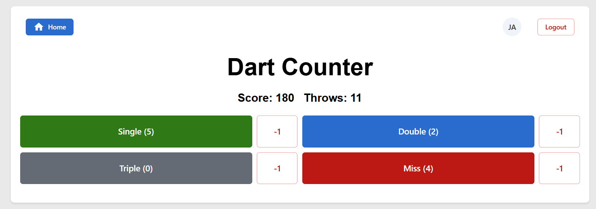

# Dart App



## Use Case
Just a simple project to lear a little about React, Auth and Databases. You can track the 20s ypu throw.

## Try It

[Demo on Vercel](https://dart-app-inky.vercel.app/)

## Installation

1.  Clone the repository.
2.  Install NPM Packages

```
npm i
```

1.  Create a `.env` file. Ive created a `.env.example`. Just rename or duplicate it.
2.  Fill the variables with your credentials. Link to all [ENV-Variabels](#env-table)
3.  Try it!

```
npm run dev
```

1.  Go to [localhost:5173](http://localhost:5173)

## ENV-Variables

<a name="env-table"></a>
|     |     |     |
| --- | --- | --- |
| Name | Explaination | Default |
| VITE_POCKETBASE_URL | The URL to your Pocketbase Instance | Not given |
|     |     |     |